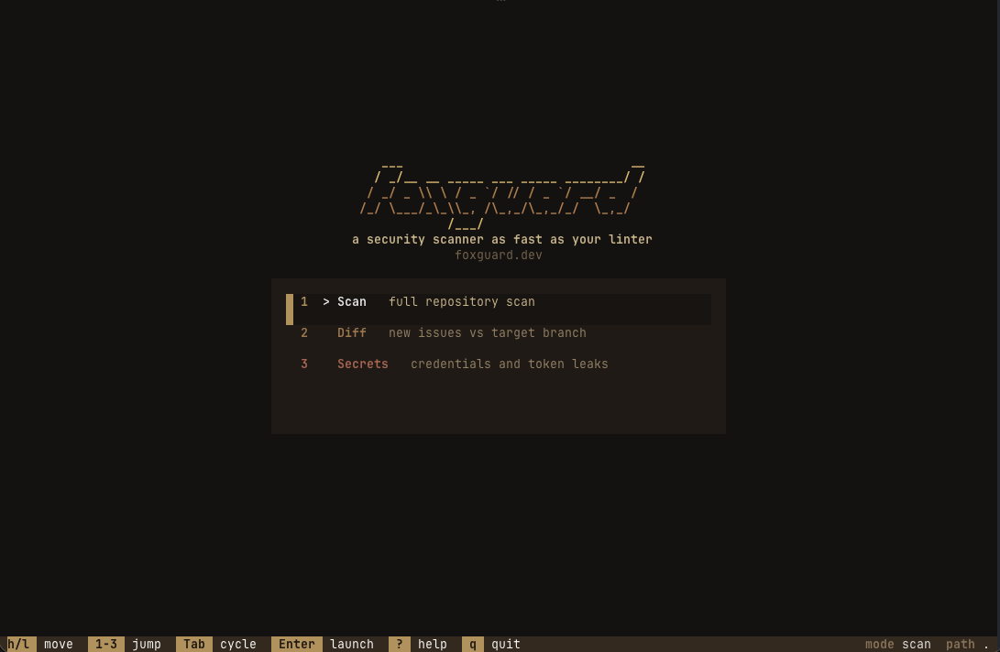
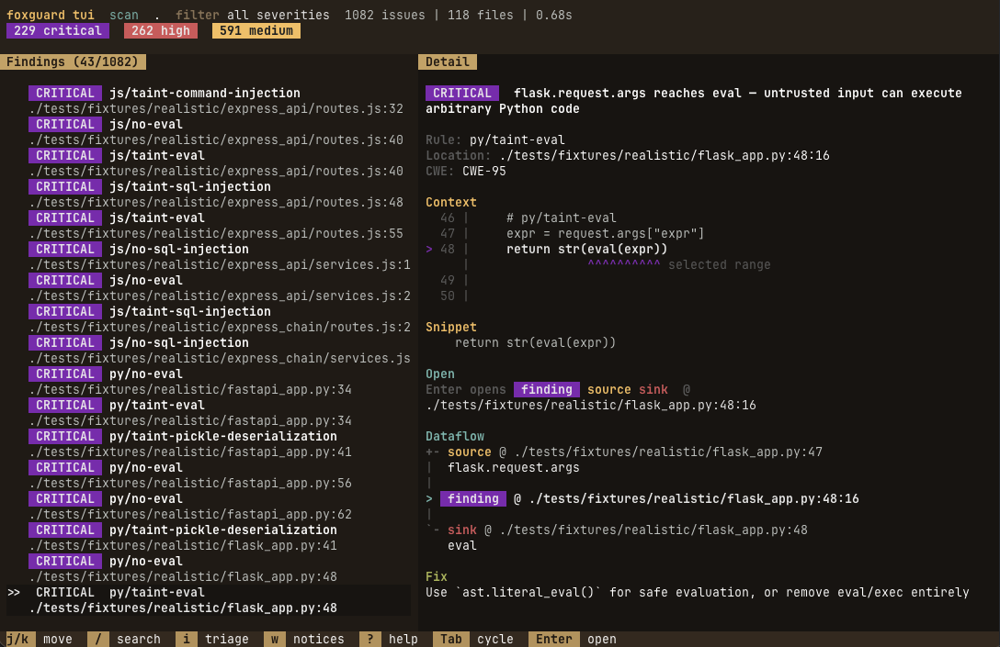
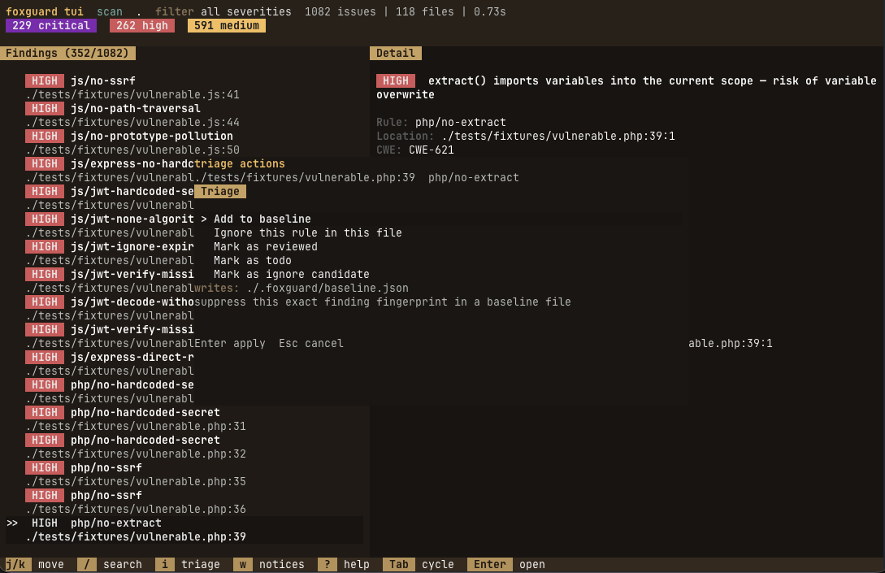

<p align="center">
  
</p>

<h1 align="center">foxguard</h1>

<p align="center">
  <strong>Sub-second local security scanning for real codebases.</strong>
  <br/>
  170+ built-in rules &middot; 10 languages &middot; cross-file taint tracking for Python, JavaScript, Go, Kotlin &middot; single Rust binary &middot; Semgrep-compatible YAML bridge
  <br/><br/>
  <a href="https://foxguard.dev">foxguard.dev</a> &middot; <a href="https://www.npmjs.com/package/foxguard">npm</a> &middot; <a href="https://crates.io/crates/foxguard">crates.io</a>
</p>

<p align="center">
  <a href="https://github.com/PwnKit-Labs/foxguard/actions/workflows/ci.yml"></a>
  <a href="https://github.com/PwnKit-Labs/foxguard"></a>
  <a href="https://crates.io/crates/foxguard"></a>
  <a href="https://www.npmjs.com/package/foxguard"></a>
  <a href="https://github.com/PwnKit-Labs/foxguard/stargazers"></a>
</p>

---

<p align="center">
  
</p>

Security scanners are slow. 10 seconds, 30 seconds, sometimes a minute. So developers don't run them locally — they get pushed to CI, findings pile up in PRs, and nobody looks at them.

foxguard fixes this by being fast enough that you never notice it's there. Same scan, 0.03 seconds instead of 10. You can run it on every save, every commit, every push. Security feedback becomes instant.

```sh
npx foxguard .
```

```
src/auth/login.js
  14:5  CRITICAL  js/no-sql-injection (CWE-89)
        SQL query built with template literal interpolation

src/utils/config.py
   7:1  HIGH      py/no-hardcoded-secret (CWE-798)
        Hardcoded secret in 'api_key'

WARNING 2 issues in 5 files (0.03s): 1 critical, 1 high, 0 medium, 0 low
```

## Why foxguard

- **Fast enough to leave on.** foxguard is built for local runs, pre-commit hooks, and changed-file scans instead of “security later in CI”.
- **Useful before you tune anything.** The default value is built-in framework-aware rules for common real-world mistakes across JavaScript, Python, Go, Ruby, Java, PHP, Rust, C#, and Swift.
- **Taint tracking built in.** Intraprocedural taint flow from framework sources (Flask, Django, FastAPI, Express, Next.js, Hono, Gin, net/http) into sinks like `eval`, `exec`, SQL execute, and SSRF — no rule writing required.
- **Adoption-friendly.** If you already have Semgrep/OpenGrep YAML, foxguard can load a focused compatible subset on top of built-ins so migration is incremental instead of all-or-nothing.

See [docs/precision.md](docs/precision.md) for per-rule precision tiers and our false-positive methodology.

## Quick start

```sh
npx foxguard .                        # scan the repo
npx foxguard tui .                    # interactive findings explorer
npx foxguard --changed .              # only modified files
npx foxguard diff main .              # new findings vs target branch
npx foxguard tui --diff main .        # interactive diff triage
npx foxguard --explain .              # show source-to-sink dataflow traces
npx foxguard --quiet .                # exit code only (CI mode)
npx foxguard --github-pr 42 .         # post findings as PR review comments
npx foxguard secrets .                # leaked credentials and private keys
npx foxguard tui --secrets .          # interactive secrets triage
npx foxguard init                     # install a local pre-commit hook
```

## Interactive triage (v0.7.0)

`foxguard tui` opens a full terminal UI for local triage: pick a mode, walk findings, and mark/baseline/ignore without leaving the terminal.

<p align="center">
  
  <br/><em>Launch picker: Scan, Diff, or Secrets</em>
</p>

<p align="center">
  
  <br/><em>Findings list with source/sink dataflow and open-target controls</em>
</p>

<p align="center">
  
  <br/><em>Triage popup: review state, baseline, and ignore-rule actions</em>
</p>

## What it is

Rust + [tree-sitter](https://tree-sitter.github.io/) for AST parsing + [rayon](https://github.com/rayon-rs/rayon) for parallelism. No JVM startup, no Python interpreter, no network calls, no rule download step. Just a native binary that reads your files and reports findings.

170+ built-in rules across 10 languages. SQL injection, XSS, SSRF, command injection, hardcoded secrets, weak crypto, unsafe deserialization, log injection, and framework-specific checks for Express, Django, Rails, Spring, Laravel, Gin, Kotlin, .NET, and iOS. Python, JavaScript, and Go also get a taint engine that follows untrusted input from framework request sources into dangerous sinks — including **across file boundaries** via two-pass function summary analysis.

Also scans for leaked credentials (AWS keys, GitHub/GitLab/Slack/Stripe tokens, private keys) with redacted output. Loads Semgrep-compatible YAML rules with `--rules` if you have existing ones. Outputs terminal, JSON, or SARIF for GitHub Code Scanning.

`foxguard diff main` shows only new findings introduced by your changes. `--github-pr` posts findings as inline review comments on pull requests. `--explain` shows source-to-sink dataflow traces with fix suggestions.

foxguard dogfoods itself — it scans its own Rust source in CI on every push.

## What it is not

foxguard is not trying to be a full Semgrep or OpenGrep drop-in replacement.

The intended model is:

- **foxguard built-ins** for fast local feedback
- **Semgrep/OpenGrep-compatible YAML subset** as an adoption bridge
- **Semgrep/OpenGrep themselves** when you need the broadest external rule ecosystem

That boundary is deliberate. It keeps local scans fast, rule support understandable, and compatibility claims testable.

## Install

```sh
npx foxguard .                         # no install needed
brew install peaktwilight/tap/foxguard # Homebrew (macOS/Linux)
cargo install foxguard                 # crates.io
```

**Editor:** Install the [VS Code extension](https://marketplace.visualstudio.com/items?itemName=peaktwilight.foxguard) — scans on save, shows findings as underlines.

## Benchmarks

Reproducible benchmarks via `./benchmarks/run.sh`. Numbers below are from a local run on an Apple Silicon laptop with `foxguard 0.6.2`, `semgrep 1.156.0`, `tokei 14.0.0`. LoC is counted by tokei, scoped to the target language only (no vendored HTML/JSON).

| Repo | Files | LoC | foxguard | Semgrep | Speedup |
|------|-------|-----|----------|---------|---------|
| express (framework) | 141 | 15,804 JS | **0.276s** | 6.09s | **22x** |
| flask (framework) | 83 | 14,029 Py | **0.333s** | 6.51s | **20x** |
| gin (framework) | 99 | 17,669 Go | **0.499s** | 4.95s | **10x** |
| **sentry (production)** | **8,539** | **1,291,606 Py** | **35.4s** | 194.0s | **5x** |

Sentry is the larger-corpus stress target: a real production monitoring platform at ~1.3M Python LoC. foxguard scans the whole tree in ~35 seconds; Semgrep with `--config auto` takes ~3m14s. The framework benchmarks (express/flask/gin) are sub-second. Run on one machine — your numbers will vary; reproduce locally with `./benchmarks/run.sh`.

To reproduce: `./benchmarks/run.sh` (add `BENCH_SKIP_LARGE=1` for the quick matrix only). See `benchmarks/README.md` for the reproduction recipe.

## Built-in coverage

| Language | Rules | Frameworks |
|----------|-------|------------|
| JavaScript/TypeScript | 27 | Express, Next.js, Hono, Fastify, SvelteKit, Deno, JWT, XSS, taint |
| Python | 32 | Flask, Django, FastAPI, CSRF, session, intraprocedural taint |
| Go | 11 | Gin, net/http, TLS, intraprocedural taint |
| Ruby | 10 | Rails, mass assignment, CSRF |
| Java | 10 | Spring, XXE, deserialization |
| PHP | 10 | Laravel, file inclusion, unserialize |
| Rust | 10 | unsafe, transmute, TLS |
| C# | 10 | .NET, LDAP, XXE, CORS |
| Swift | 10 | iOS keychain, transport, WebView |

## Why teams adopt it

- **Changed-file scans** for tight local loops
- **Repo-local baselines** so legacy findings stop blocking adoption
- **Secrets scanning** alongside code scanning
- **JSON and SARIF output** for CI and GitHub Code Scanning
- **Semgrep/OpenGrep YAML subset** when teams already have rule investments

## Compatibility

Load existing Semgrep/OpenGrep YAML rules with `--rules`. Supports `pattern`, `pattern-regex`, `pattern-either`, `pattern-not`, `pattern-inside`, `pattern-not-inside`, `metavariable-regex`, and `paths.include/exclude`. This supported subset is parity-tested in CI against the real `semgrep` CLI. See [`COMPATIBILITY.md`](./COMPATIBILITY.md).

foxguard does not currently aim to support multiple unrelated external rule formats. The compatibility target is the focused Semgrep/OpenGrep YAML subset above.

## CI Integration

### GitHub Actions

```yaml
name: Security
on: [push, pull_request]
jobs:
  foxguard:
    runs-on: ubuntu-latest
    permissions:
      security-events: write
    steps:
      - uses: actions/checkout@v4
      - uses: PwnKit-Labs/foxguard/action@v0.7.0
        with:
          path: .
          severity: medium
          fail-on-findings: "true"
          upload-sarif: "true"
```

Findings show up in **Security → Code Scanning**.

### Any CI

```sh
npx foxguard@latest .                             # scan
npx foxguard@latest --format sarif . > out.sarif   # SARIF output
npx foxguard@latest secrets .                      # secrets
```

### Badge

```md
[](https://github.com/PwnKit-Labs/foxguard)
```

### Pre-commit

```yaml
repos:
  - repo: https://github.com/PwnKit-Labs/foxguard
    rev: v0.7.0
    hooks:
      - id: foxguard
      - id: foxguard-secrets
```

Or run `foxguard init` to install a git hook directly.

### Claude Code

Add foxguard as a pre-commit hook in your Claude Code configuration to automatically scan agent-written code before each commit:

```json
{
  "hooks": {
    "PreCommit": [
      {
        "command": "npx foxguard --changed --severity high .",
        "description": "foxguard security scan"
      }
    ]
  }
}
```

Add this to `.claude/settings.json` in your project root. Claude Code will run foxguard before every commit and block if high-severity findings are detected, giving the agent a chance to fix issues before they land. See [docs/claude-code-integration.md](docs/claude-code-integration.md) for the full setup guide.

## Configuration

foxguard auto-discovers `.foxguard.yml` from the scan path upward.

```yaml
scan:
  baseline: .foxguard/baseline.json
  rules: ./semgrep-rules

secrets:
  baseline: .foxguard/secrets-baseline.json
  exclude_paths:
    - fixtures
    - testdata
  ignore_rules:
    - secret/github-token
```

## Suppressing Deliberate Findings

For one-off, deliberate code patterns, you can suppress code-scan findings inline instead of
adding them to a baseline.

```js
// Ignore the next code line for one rule
// foxguard: ignore[js/no-ssrf]
fileContent = fetch(userControlledUrl);

// Ignore the current line for one rule
fileContent = fetch(userControlledUrl); // foxguard: ignore[js/no-ssrf]

// Ignore the current line for all foxguard code findings
eval(userInput); // foxguard: ignore
```

Notes:

- Inline ignores currently apply to code scanning findings, not `foxguard secrets`.
- Rule IDs must match exactly, for example `js/no-ssrf`.
- Comment-only directives apply to the next non-empty, non-comment code line.
- Supported comment styles are `//` and `#`, depending on the language.

## Contributing

Adding a rule is one struct implementing a trait. See [`CONTRIBUTING.md`](./CONTRIBUTING.md).

## Part of PwnKit Labs

**Open-source adversarial security for the agentic AI era.** foxguard is one piece of the open-source PwnKit Labs stack:
- **[pwnkit](https://github.com/PwnKit-Labs/pwnkit)** — AI agent pentester (detect)
- **[foxguard](https://github.com/PwnKit-Labs/foxguard)** — Rust security scanner (prevent)
- **[opensoar](https://github.com/opensoar-hq/opensoar-core)** — Python-native SOAR platform (respond)

## License

MIT
